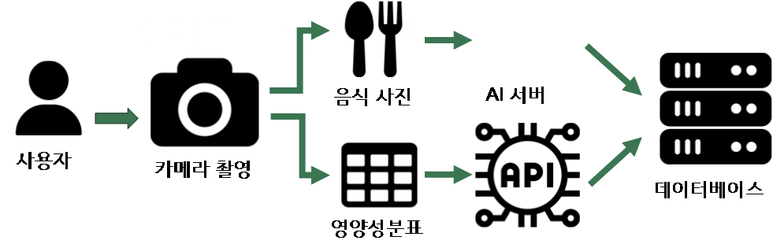
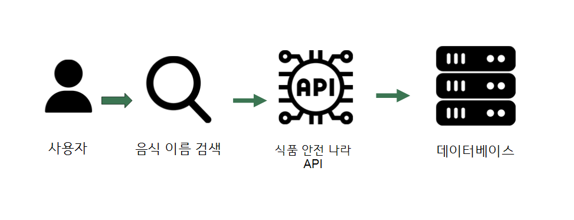
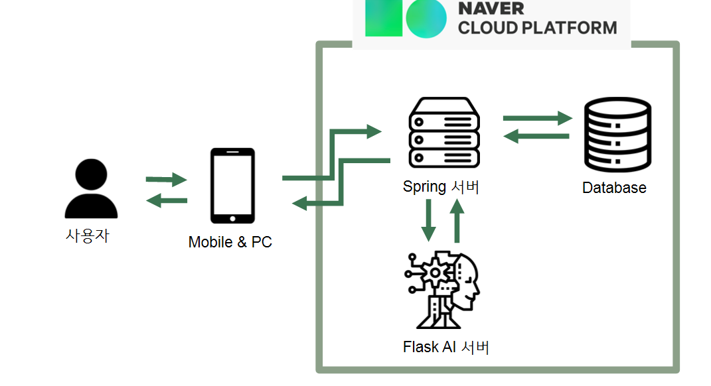
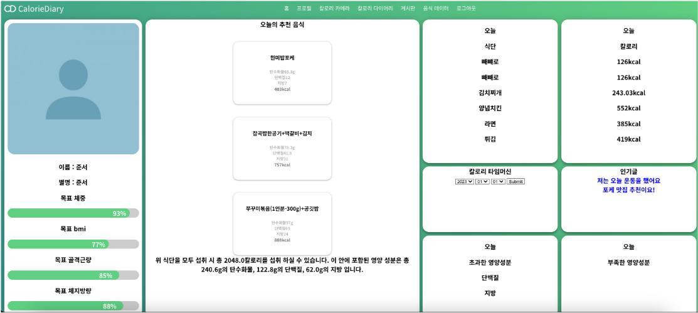
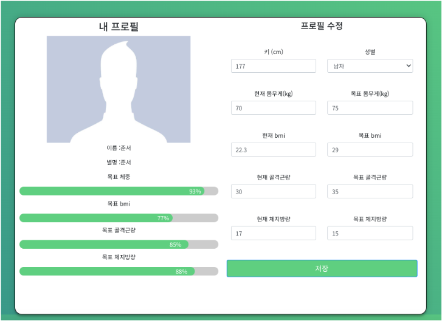
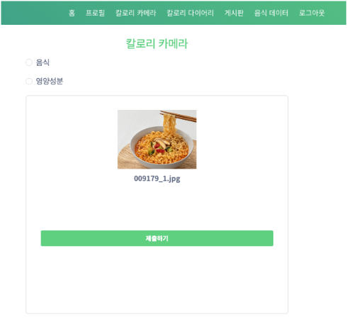
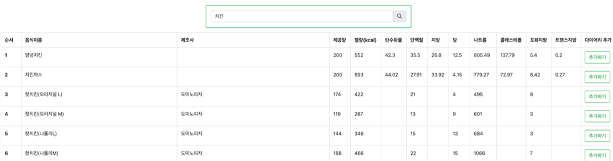
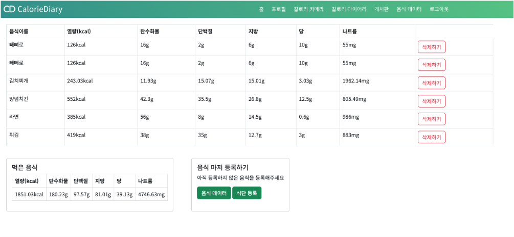

# 사진인식 기반 건강관리 서비스

### 개발 목적

---

많은 사람들이 겪고 있는 영양 불균형 문제 해결 및 자신이 섭취하는 음식에 대해 영양성분을 기록함으로써 균형 잡힌 식습관을 형성하는데 도움을 준다.

### UI 및 기능 설명

---

- 홈
    - 현재 신체 정보 대비 목표치를 퍼센티지로 표시한다.
    - 성별과 목표치에 따른 적정 칼로리를 계산해 식단을 추천해준다.
    - 오늘 먹은 음식과 그 음식의 칼로리를 보여준다.
    - 특정 날짜를 선택해 그 날 먹은 음식과 그 음식의 칼로리를 보여준다.
    - 게시판에서 조회수가 많은 3개의 글을 보여준다.
    - 내가 오늘 먹은 음식의 영양 성분을 계산해서 부족한 영양 성분과 초과한 영양 성분을 보여준다.

- 프로필
    - 자신의 신체 정보(키, 몸무게, 체지방률, 골격근량 등)를 작성하고 개선 가능한 신체 정보의 목표치를 설정한다.

- 식단 기록
    - 자신이 먹은 음식을 기록하기 위한 기능으로 음식을 사진 찍으면 ai서버를 거쳐 그 사진이 어떤 음식인지를 인식해 기록해준다.
    - 인식되지 않았을 경우를 대비해 식품 안전 나라에서 제공하는 데이터베이스를 통해 수동으로도 음식을 검색 및 추가할 수 있게 한다.

- 게시판
    - 건강 관련 지식이나 자신의 생활 습관을 공유할 수 있도록 한다.
    - 조회수가 가장 높은 글은 홈 화면에 보일 수 있도록 한다.

### 구성도

---

1. 카메라 구성도

1. 수동 음식 추가 구성도

1. 서버 구성도

### 기술 스택

---

- 음식 인식
    - YOLOv5
    - roboflow
- 영양성분인식(API)
    - 네이버 CLOVA OCR API
- 서버
    - 스프링 프레임워크
    - 플라스크
- 데이터 베이스
    - MariaDB
- 공공 데이터
    - 식품영양성분 데이터베이스

### 실행 화면

---

홈 화면

- 여러 기능들이 들어있는 메인 화면이다.

프로필 화면

- 프로필을 갱신할 수 있는 화면이다.
- 홈 화면에도 반영된다.

칼로리 카메라 화면

- 음식과 영양성분표 중 인식할 사진을 선택할 수 있다.
- 이미지를 업로드 후 제출하기 화면을 클릭할 시 칼로리 다이어리 화면에 해당 음식이 추가된다.

음식 데이터 화면

- 사진이 인식되지 않을 경우를 대비해 만든 기능이다.
- 식품안전나라로부터 받아온 음식을 검색해서 직접 추가할 수 있다.

칼로리 다이어리 화면

- 칼로리 카메라, 음식 데이터를 통해 추가된 음식들이 보이는 화면이다.
- 하루가 끝나면 그 날 먹은 음식은 자동으로 데이터베이스에 저장된다.

### 소개 영상

---

https://player.vimeo.com/video/955142504?badge=0&amp;autopause=0&amp;player_id=0&amp;app_id=58479
